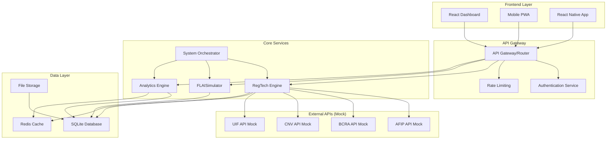
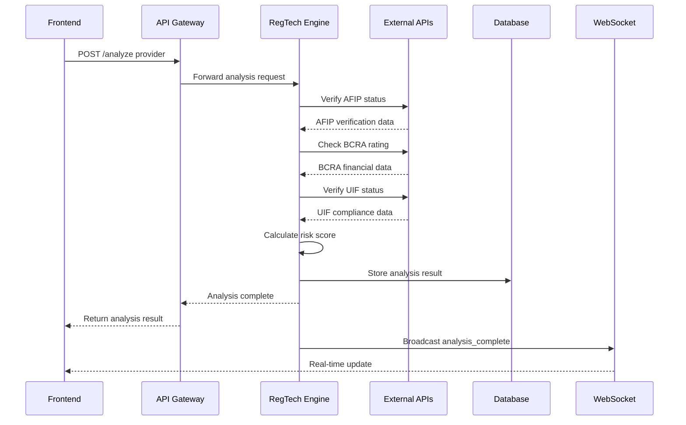
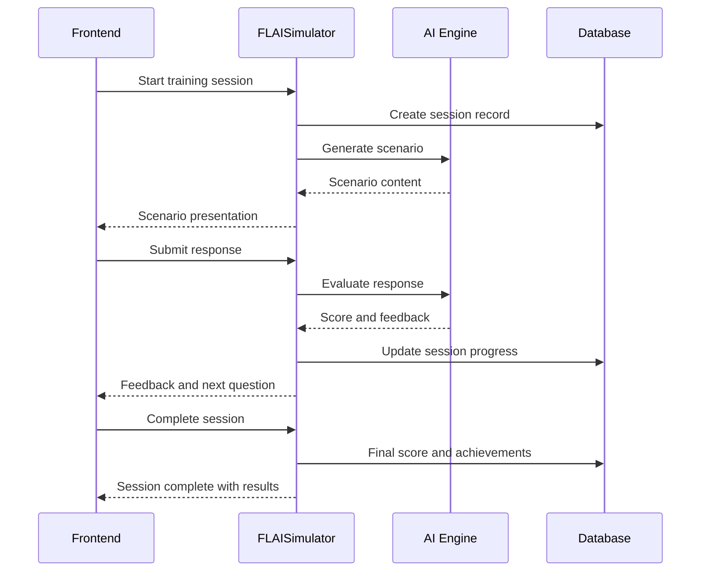
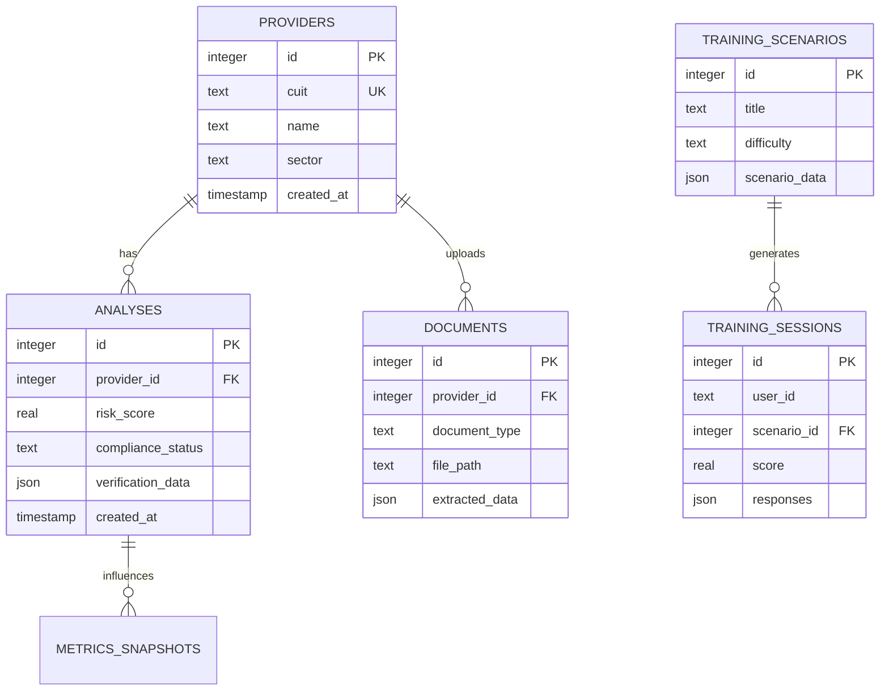
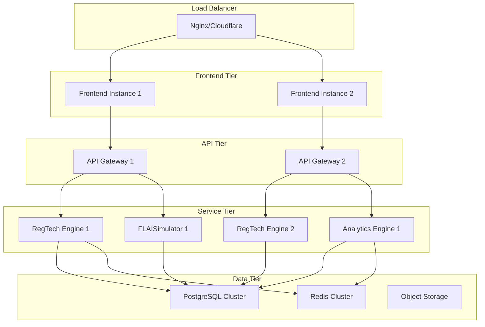

# 🏗️ Architecture Overview - IntegridAI HackAI 2025

## 🎯 **System Overview**

IntegridAI es un **ecosistema completo de RegTech** que combina análisis automático de compliance, capacitación ética gamificada, y analytics predictivos en una plataforma unificada para el mercado argentino.

---

## 📐 **High-Level Architecture**



---

## 🧩 **Component Architecture**

### **Frontend Components**

#### **React Dashboard (Port 3000)**
```typescript
src/frontend/
├── components/
│   ├── ui/              # Base UI components
│   │   ├── Button.tsx
│   │   ├── Card.tsx
│   │   ├── Chart.tsx
│   │   └── Modal.tsx
│   ├── layout/          # Layout components
│   │   ├── DashboardLayout.tsx
│   │   ├── Sidebar.tsx
│   │   └── Header.tsx
│   ├── providers/       # Provider management
│   │   ├── ProviderGrid.tsx
│   │   ├── ProviderDetails.tsx
│   │   └── AnalysisResults.tsx
│   ├── training/        # Training hub
│   │   ├── ScenarioLauncher.tsx
│   │   ├── ProgressTracker.tsx
│   │   └── AchievementBadges.tsx
│   └── analytics/       # Analytics & reports
│       ├── DashboardCharts.tsx
│       ├── RiskHeatmap.tsx
│       └── ReportBuilder.tsx
├── pages/
│   ├── Dashboard.tsx
│   ├── Providers.tsx
│   ├── Training.tsx
│   ├── Analytics.tsx
│   └── Reports.tsx
├── hooks/
│   ├── useProviderAnalysis.ts
│   ├── useDashboardData.ts
│   └── useTrainingSession.ts
├── services/
│   ├── api.ts
│   ├── websocket.ts
│   └── cache.ts
└── utils/
    ├── formatters.ts
    ├── validators.ts
    └── constants.ts
```

#### **Mobile PWA/React Native**
```typescript
mobile/
├── src/
│   ├── components/
│   │   ├── scanner/     # Document scanner
│   │   ├── analysis/    # Provider analysis
│   │   └── dashboard/   # Mobile dashboard
│   ├── screens/
│   │   ├── ScannerScreen.tsx
│   │   ├── AnalysisScreen.tsx
│   │   └── DashboardScreen.tsx
│   ├── services/
│   │   ├── ocrService.ts
│   │   ├── syncService.ts
│   │   └── storageService.ts
│   └── navigation/
│       └── AppNavigator.tsx
```

---

## ⚙️ **Backend Services**

### **RegTech Engine (Port 8000)**

#### **Core Architecture**
```python
src/backend/regtech/
├── api/
│   ├── routes/
│   │   ├── providers.py     # Provider CRUD operations
│   │   ├── analysis.py      # Analysis endpoints
│   │   └── documents.py     # Document management
│   └── middleware/
│       ├── auth.py
│       ├── rate_limit.py
│       └── cors.py
├── models/
│   ├── provider.py          # Provider data model
│   ├── analysis.py          # Analysis results model
│   └── document.py          # Document model
├── services/
│   ├── analysis_engine.py   # Core analysis logic
│   ├── risk_calculator.py   # Risk scoring algorithms
│   ├── verification_service.py  # External API integration
│   └── document_processor.py    # OCR and document handling
├── utils/
│   ├── database.py
│   ├── cache.py
│   └── validators.py
└── config/
    ├── settings.py
    └── database_config.py
```

#### **Analysis Engine Flow**
```python
class AnalysisEngine:
    async def analyze_provider(self, provider_data: ProviderData) -> AnalysisResult:
        """
        Complete provider analysis workflow
        """
        # 1. Data validation and normalization
        validated_data = self.validate_input(provider_data)
        
        # 2. External verification (mock APIs)
        verifications = await self.verify_external_sources(validated_data)
        
        # 3. Risk calculation
        risk_score = self.calculate_risk_score(validated_data, verifications)
        
        # 4. Compliance status determination
        compliance_status = self.determine_compliance_status(risk_score, verifications)
        
        # 5. Generate recommendations
        recommendations = self.generate_recommendations(risk_score, verifications)
        
        # 6. Store results
        analysis_result = AnalysisResult(
            provider_id=provider_data.id,
            risk_score=risk_score,
            compliance_status=compliance_status,
            verifications=verifications,
            recommendations=recommendations
        )
        
        await self.store_analysis(analysis_result)
        
        return analysis_result
```

### **FLAISimulator Engine (Port 8001)**

#### **Training Architecture**
```python
src/backend/training/
├── api/
│   ├── scenarios.py         # Scenario management
│   ├── sessions.py          # Training sessions
│   └── progress.py          # User progress tracking
├── models/
│   ├── scenario.py          # Training scenario model
│   ├── session.py           # Training session model
│   └── user_progress.py     # Progress tracking model
├── services/
│   ├── scenario_engine.py   # Scenario generation
│   ├── ai_tutor.py          # AI conversation engine
│   ├── scoring_engine.py    # Performance scoring
│   └── gamification.py      # Achievement system
└── data/
    ├── scenarios/           # Scenario definitions
    ├── questions/           # Question bank
    └── achievements/        # Achievement definitions
```

### **Analytics Engine (Port 8002)**

#### **Analytics Architecture**
```python
src/backend/analytics/
├── api/
│   ├── dashboard.py         # Dashboard metrics
│   ├── reports.py           # Report generation
│   └── exports.py           # Data export
├── models/
│   ├── metrics.py           # Metrics model
│   └── report.py            # Report model
├── services/
│   ├── metrics_calculator.py    # KPI calculations
│   ├── trend_analyzer.py        # Trend analysis
│   ├── report_generator.py      # Report creation
│   └── data_aggregator.py       # Data aggregation
└── utils/
    ├── chart_generator.py       # Chart creation
    └── export_utils.py          # Export utilities
```

---

## 🔄 **Data Flow Architecture**

### **Provider Analysis Workflow**


### **Training Session Flow**


---

## 🗄️ **Database Architecture**

### **SQLite Schema Design**
```sql
-- Core Provider Management
CREATE TABLE providers (
    id INTEGER PRIMARY KEY AUTOINCREMENT,
    cuit TEXT UNIQUE NOT NULL,
    name TEXT NOT NULL,
    sector TEXT,
    website TEXT,
    employees INTEGER,
    annual_revenue REAL,
    created_at TIMESTAMP DEFAULT CURRENT_TIMESTAMP,
    updated_at TIMESTAMP DEFAULT CURRENT_TIMESTAMP
);

-- Analysis Results
CREATE TABLE analyses (
    id INTEGER PRIMARY KEY AUTOINCREMENT,
    provider_id INTEGER REFERENCES providers(id),
    analysis_type TEXT NOT NULL DEFAULT 'comprehensive',
    risk_score REAL NOT NULL,
    risk_level TEXT NOT NULL, -- low, medium, high, critical
    compliance_status TEXT NOT NULL,
    verification_data JSON, -- External API results
    risk_factors JSON, -- Risk factor breakdown
    recommendations JSON, -- Generated recommendations
    documents_analyzed INTEGER DEFAULT 0,
    next_review_date DATE,
    created_at TIMESTAMP DEFAULT CURRENT_TIMESTAMP
);

-- Training System
CREATE TABLE training_scenarios (
    id INTEGER PRIMARY KEY AUTOINCREMENT,
    title TEXT NOT NULL,
    description TEXT,
    difficulty TEXT NOT NULL, -- beginner, intermediate, advanced
    duration_minutes INTEGER,
    category TEXT,
    learning_objectives JSON,
    scenario_data JSON, -- Questions, options, etc.
    created_at TIMESTAMP DEFAULT CURRENT_TIMESTAMP
);

CREATE TABLE training_sessions (
    id INTEGER PRIMARY KEY AUTOINCREMENT,
    user_id TEXT NOT NULL,
    scenario_id INTEGER REFERENCES training_scenarios(id),
    started_at TIMESTAMP DEFAULT CURRENT_TIMESTAMP,
    completed_at TIMESTAMP,
    score REAL,
    responses JSON, -- User responses and evaluations
    achievements_earned JSON,
    session_data JSON -- Session state and progress
);

-- Document Management
CREATE TABLE documents (
    id INTEGER PRIMARY KEY AUTOINCREMENT,
    provider_id INTEGER REFERENCES providers(id),
    document_type TEXT NOT NULL, -- cuit, afip_constancia, balance, etc.
    file_path TEXT,
    file_size INTEGER,
    mime_type TEXT,
    extracted_data JSON, -- OCR results
    processing_status TEXT DEFAULT 'pending',
    uploaded_at TIMESTAMP DEFAULT CURRENT_TIMESTAMP,
    processed_at TIMESTAMP
);

-- Analytics and Metrics
CREATE TABLE metrics_snapshots (
    id INTEGER PRIMARY KEY AUTOINCREMENT,
    metric_type TEXT NOT NULL, -- dashboard, risk_distribution, etc.
    metric_data JSON,
    calculated_at TIMESTAMP DEFAULT CURRENT_TIMESTAMP
);

-- System Configuration
CREATE TABLE system_config (
    key TEXT PRIMARY KEY,
    value TEXT,
    updated_at TIMESTAMP DEFAULT CURRENT_TIMESTAMP
);
```

### **Database Relationships**


---

## 🔌 **API Gateway Architecture**

### **Routing Configuration**
```typescript
// api-gateway/routes.ts
const routeConfig = {
  '/api/providers': {
    service: 'regtech-engine',
    port: 8000,
    auth: 'optional',
    rateLimit: '100/minute'
  },
  '/api/training': {
    service: 'flaisimulator',
    port: 8001,
    auth: 'required',
    rateLimit: '50/minute'
  },
  '/api/analytics': {
    service: 'analytics-engine',
    port: 8002,
    auth: 'required',
    rateLimit: '200/minute'
  },
  '/api/mock/*': {
    service: 'mock-apis',
    port: 3001,
    auth: 'none',
    rateLimit: '1000/minute'
  }
};

// Load balancing and health checking
const serviceHealth = {
  'regtech-engine': {
    healthCheck: 'http://localhost:8000/health',
    instances: ['localhost:8000'],
    strategy: 'round-robin'
  },
  // ... other services
};
```

### **Middleware Stack**
```typescript
// Middleware execution order
app.use(corsMiddleware);
app.use(requestIdMiddleware);
app.use(loggingMiddleware);
app.use(authMiddleware);
app.use(rateLimitingMiddleware);
app.use(routingMiddleware);
app.use(errorHandlingMiddleware);
```

---

## 🚀 **Deployment Architecture**

### **Development Environment**
```yaml
# docker-compose.dev.yml
version: '3.8'
services:
  frontend:
    build: ./src/frontend
    ports:
      - "3000:3000"
    environment:
      - NODE_ENV=development
    volumes:
      - ./src/frontend:/app
      - /app/node_modules
  
  regtech-engine:
    build: ./src/backend/regtech
    ports:
      - "8000:8000"
    environment:
      - ENVIRONMENT=development
      - DATABASE_URL=sqlite:///data/integridai.db
    volumes:
      - ./data:/data
      - ./src/backend/regtech:/app
  
  flaisimulator:
    build: ./src/backend/training
    ports:
      - "8001:8001"
    environment:
      - ENVIRONMENT=development
    volumes:
      - ./data:/data
      - ./src/backend/training:/app
  
  analytics-engine:
    build: ./src/backend/analytics
    ports:
      - "8002:8002"
    environment:
      - ENVIRONMENT=development
    volumes:
      - ./data:/data
      - ./src/backend/analytics:/app
  
  mock-apis:
    build: ./api/mock
    ports:
      - "3001:3001"
    environment:
      - NODE_ENV=development
```

### **Production Architecture**

#### **Microservices Deployment**


---

## 🔒 **Security Architecture**

### **Security Layers**
```typescript
// Security middleware stack
const securityConfig = {
  cors: {
    origin: process.env.ALLOWED_ORIGINS?.split(',') || ['http://localhost:3000'],
    credentials: true,
    optionsSuccessStatus: 200
  },
  
  rateLimit: {
    windowMs: 60 * 1000, // 1 minute
    max: 100, // requests per window
    message: 'Too many requests from this IP'
  },
  
  helmet: {
    contentSecurityPolicy: {
      directives: {
        defaultSrc: ["'self'"],
        styleSrc: ["'self'", "'unsafe-inline'", "https://fonts.googleapis.com"],
        fontSrc: ["'self'", "https://fonts.gstatic.com"],
        imgSrc: ["'self'", "data:", "https:"],
        scriptSrc: ["'self'"]
      }
    }
  },
  
  authentication: {
    jwt: {
      secret: process.env.JWT_SECRET,
      expiresIn: '24h'
    },
    bcrypt: {
      saltRounds: 12
    }
  }
};
```

### **Data Protection**
```sql
-- Sensitive data encryption
CREATE TABLE encrypted_data (
    id INTEGER PRIMARY KEY,
    entity_id INTEGER,
    entity_type TEXT,
    encrypted_data BLOB, -- AES-256 encrypted
    encryption_key_id TEXT,
    created_at TIMESTAMP
);

-- Audit logging
CREATE TABLE audit_log (
    id INTEGER PRIMARY KEY,
    user_id TEXT,
    action TEXT,
    entity_type TEXT,
    entity_id INTEGER,
    old_values JSON,
    new_values JSON,
    ip_address TEXT,
    user_agent TEXT,
    timestamp TIMESTAMP DEFAULT CURRENT_TIMESTAMP
);
```

---

## 📊 **Performance Architecture**

### **Caching Strategy**
```typescript
// Multi-layer caching
const cachingLayers = {
  // L1: In-memory cache (Node.js)
  memory: {
    provider_basic: '5m',
    dashboard_metrics: '1m',
    user_sessions: '30m'
  },
  
  // L2: Redis cache
  redis: {
    analysis_results: '1h',
    training_scenarios: '24h',
    aggregated_metrics: '15m'
  },
  
  // L3: Database query optimization
  database: {
    indexes: ['providers.cuit', 'analyses.provider_id', 'training_sessions.user_id'],
    materialized_views: ['dashboard_metrics_hourly', 'risk_distribution_daily']
  },
  
  // L4: CDN (Static assets)
  cdn: {
    assets: '7d',
    api_responses: '5m'
  }
};
```

### **Database Optimization**
```sql
-- Performance indexes
CREATE INDEX idx_providers_cuit ON providers(cuit);
CREATE INDEX idx_providers_sector ON providers(sector);
CREATE INDEX idx_analyses_provider_id ON analyses(provider_id);
CREATE INDEX idx_analyses_created_at ON analyses(created_at);
CREATE INDEX idx_analyses_risk_score ON analyses(risk_score);
CREATE INDEX idx_training_sessions_user_id ON training_sessions(user_id);
CREATE INDEX idx_documents_provider_id ON documents(provider_id);
CREATE INDEX idx_documents_type ON documents(document_type);

-- Materialized views for dashboard
CREATE VIEW dashboard_metrics_live AS
SELECT 
    COUNT(*) as total_providers,
    AVG(latest_analysis.risk_score) as avg_risk_score,
    COUNT(CASE WHEN latest_analysis.risk_level = 'high' THEN 1 END) as high_risk_count,
    COUNT(CASE WHEN latest_analysis.compliance_status = 'compliant' THEN 1 END) as compliant_count
FROM providers 
LEFT JOIN (
    SELECT DISTINCT provider_id, 
           FIRST_VALUE(risk_score) OVER (PARTITION BY provider_id ORDER BY created_at DESC) as risk_score,
           FIRST_VALUE(risk_level) OVER (PARTITION BY provider_id ORDER BY created_at DESC) as risk_level,
           FIRST_VALUE(compliance_status) OVER (PARTITION BY provider_id ORDER BY created_at DESC) as compliance_status
    FROM analyses
) latest_analysis ON providers.id = latest_analysis.provider_id;
```

---

## 🔄 **Integration Architecture**

### **External API Mock System**
```typescript
// Mock API configuration
const mockApiConfig = {
  afip: {
    baseUrl: 'http://localhost:3001/api/mock/afip',
    endpoints: {
      validateCuit: '/validate-cuit',
      getFiscalData: '/fiscal-data',
      getConstancia: '/constancia'
    },
    responseTime: '200-500ms', // Simulate real API latency
    errorRate: 0.05 // 5% error rate for testing
  },
  
  bcra: {
    baseUrl: 'http://localhost:3001/api/mock/bcra',
    endpoints: {
      getCreditRating: '/credit-rating',
      getFinancialData: '/financial-data'
    },
    responseTime: '300-800ms',
    errorRate: 0.03
  },
  
  uif: {
    baseUrl: 'http://localhost:3001/api/mock/uif',
    endpoints: {
      checkAmlStatus: '/aml-status',
      getSuspiciousActivities: '/suspicious-activities'
    },
    responseTime: '500-1000ms',
    errorRate: 0.02
  }
};
```

### **WebSocket Architecture**
```typescript
// Real-time event system
class WebSocketManager {
  private connections = new Map<string, WebSocket>();
  
  broadcast(event: SystemEvent) {
    const message = JSON.stringify(event);
    this.connections.forEach((ws, userId) => {
      if (ws.readyState === WebSocket.OPEN) {
        ws.send(message);
      }
    });
  }
  
  sendToUser(userId: string, event: SystemEvent) {
    const ws = this.connections.get(userId);
    if (ws && ws.readyState === WebSocket.OPEN) {
      ws.send(JSON.stringify(event));
    }
  }
}

// Event types
interface SystemEvent {
  type: 'analysis_complete' | 'risk_alert' | 'training_completed' | 'system_update';
  timestamp: string;
  data: any;
  userId?: string;
}
```

---

## 📱 **Mobile Architecture**

### **React Native Architecture**
```typescript
// Mobile app architecture
src/mobile/
├── src/
│   ├── components/
│   │   ├── common/      # Shared components
│   │   ├── scanner/     # Camera and OCR
│   │   ├── analysis/    # Provider analysis
│   │   └── charts/      # Data visualization
│   ├── screens/
│   │   ├── tabs/        # Bottom tab screens
│   │   ├── modals/      # Modal screens
│   │   └── stacks/      # Stack navigators
│   ├── services/
│   │   ├── api/         # API client
│   │   ├── storage/     # Local storage
│   │   ├── sync/        # Offline sync
│   │   ├── ocr/         # OCR processing
│   │   └── camera/      # Camera handling
│   ├── utils/
│   │   ├── database/    # SQLite helpers
│   │   ├── encryption/  # Data encryption
│   │   └── validation/  # Input validation
│   └── store/
│       ├── slices/      # Redux slices
│       └── middleware/  # Custom middleware
```

### **Offline-First Architecture**
```typescript
// Offline synchronization strategy
class SyncManager {
  async syncPendingChanges() {
    const pending = await this.localDB.getPendingSync();
    
    for (const change of pending) {
      try {
        await this.apiClient.sync(change);
        await this.localDB.markSynced(change.id);
      } catch (error) {
        if (error.status === 409) { // Conflict
          await this.resolveConflict(change, error.serverData);
        }
      }
    }
  }
  
  async resolveConflict(localChange: any, serverData: any) {
    // Conflict resolution strategy
    const resolution = this.conflictResolver.resolve(localChange, serverData);
    await this.localDB.update(resolution);
  }
}
```

---

## 🎯 **Scalability Considerations**

### **Horizontal Scaling**
```yaml
# Kubernetes deployment example
apiVersion: apps/v1
kind: Deployment
metadata:
  name: regtech-engine
spec:
  replicas: 3
  selector:
    matchLabels:
      app: regtech-engine
  template:
    spec:
      containers:
      - name: regtech-engine
        image: integridai/regtech-engine:latest
        resources:
          requests:
            memory: "256Mi"
            cpu: "250m"
          limits:
            memory: "512Mi"
            cpu: "500m"
```

### **Database Scaling**
```sql
-- Partitioning strategy for large datasets
CREATE TABLE analyses_2024_q1 PARTITION OF analyses 
FOR VALUES FROM ('2024-01-01') TO ('2024-04-01');

CREATE TABLE analyses_2024_q2 PARTITION OF analyses 
FOR VALUES FROM ('2024-04-01') TO ('2024-07-01');

-- Read replicas for analytics queries
CREATE PUBLICATION analytics_pub FOR TABLE analyses, providers, training_sessions;
```

---

## 🔍 **Monitoring & Observability**

### **Application Monitoring**
```typescript
// Monitoring configuration
const monitoringConfig = {
  metrics: {
    apis: {
      requestCount: 'counter',
      requestDuration: 'histogram', 
      errorRate: 'gauge'
    },
    business: {
      analysisCompleted: 'counter',
      trainingSessionsStarted: 'counter',
      averageRiskScore: 'gauge'
    }
  },
  
  alerts: {
    highErrorRate: {
      condition: 'error_rate > 0.05',
      duration: '5m',
      severity: 'warning'
    },
    analysisBacklog: {
      condition: 'pending_analyses > 100',
      duration: '10m', 
      severity: 'critical'
    }
  }
};
```

### **Health Checks**
```typescript
// Health check endpoints
app.get('/health', async (req, res) => {
  const health = {
    status: 'healthy',
    timestamp: new Date().toISOString(),
    services: {
      database: await checkDatabase(),
      cache: await checkCache(),
      externalApis: await checkExternalApis()
    }
  };
  
  const isHealthy = Object.values(health.services).every(status => status === 'healthy');
  res.status(isHealthy ? 200 : 503).json(health);
});
```

---

## 🎉 **Architecture Summary**

Esta arquitectura está diseñada para:

✅ **Escalabilidad** - Microservicios independientes  
✅ **Mantenibilidad** - Separación clara de responsabilidades  
✅ **Seguridad** - Múltiples capas de protección  
✅ **Performance** - Caching inteligente y optimizaciones  
✅ **Observabilidad** - Monitoring y logging comprehensivos  
✅ **Hackathon-Ready** - Setup simple para desarrollo rápido  

### **Key Benefits:**
- **Desarrollo Paralelo**: Equipos pueden trabajar en componentes independientes
- **Tecnología Flexible**: Cada servicio puede usar el stack más apropiado  
- **Deployment Granular**: Actualizaciones independientes por servicio
- **Fault Tolerance**: Aislamiento de fallos entre servicios
- **Real-World Ready**: Arquitectura que escala a producción

**¡Esta es la base sobre la que construirán el futuro del RegTech! 🚀**