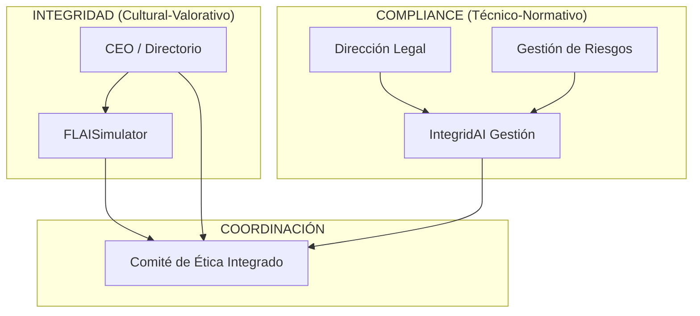

# 📋 Propuesta de Integración del Framework Lerer en IntegridAI Suite

## 🎯 **APLICACIÓN DEL MARCO TEÓRICO COMPLIANCE vs INTEGRIDAD**

Basado en el análisis del documento "Compliance e Integridad: Por qué la confusión conceptual debilita la gestión ética corporativa" por Ignacio Adrián Lerer, proponemos las siguientes mejoras estructurales a IntegridAI Suite.

---

## 🏗️ **REDEFINICIÓN ARQUITECTÓNICA**

### 📊 **Mapeo Conceptual Confirmado**

| Componente | Paradigma | Función Principal | Metodología |
|------------|-----------|-------------------|-------------|
| **🏛️ IntegridAI Gestión** | Compliance (Técnico-Normativo) | Cumplimiento Ley 27.401 | Auditoría, Controles, Verificación |
| **🎮 FLAISimulator** | Integridad (Cultural/Valorativo) | Desarrollo Capacidades Éticas | Simulación, P4 Reflection, Coaching |

### 🔄 **Separación Funcional Optimizada**

#### **🏛️ COMPLIANCE MODULE (IntegridAI Gestión)**
```typescript
// Características técnico-normativas
interface ComplianceModule {
  // Obligaciones legales
  legalRequirements: Ley27401Article[];
  regulatoryMonitoring: RegulatoryUpdate[];
  auditTrails: AuditEvidence[];
  
  // Controles y verificación
  controlFramework: InternalControl[];
  riskAssessment: RegulatoryRisk[];
  complianceMetrics: QuantitativeKPI[];
  
  // Reporte y documentación
  reportingStructure: 'Legal' | 'Audit' | 'Risk';
  evidenceGeneration: ForensicEvidence[];
  regulatoryCommunication: RegulatoryReport[];
}
```

#### **🎮 INTEGRITY MODULE (FLAISimulator)**  
```typescript
// Características cultural-valorativas
interface IntegrityModule {
  // Desarrollo de capacidades
  ethicalSimulations: VaccinationScenario[];
  p4Reflections: ReflectionFramework[];
  leadershipCoaching: EthicalCoaching[];
  
  // Cultura y clima
  organizationalClimate: ClimateAssessment[];
  valueInternalization: ValueAssessment[];
  decisionMakingFramework: EthicalDecisionProcess[];
  
  // Reporte y autonomía
  reportingStructure: 'CEO' | 'Board' | 'Independent';
  culturalMetrics: QualitativeKPI[];
  behavioralIndicators: BehavioralAssessment[];
}
```

---

## 📊 **MÉTRICAS DIFERENCIADAS SEGÚN FRAMEWORK LERER**

### 🏛️ **KPIs de Compliance (Cuantitativos)**

```typescript
interface ComplianceKPIs {
  // Cumplimiento regulatorio
  regulatoryComplianceRate: number; // % obligaciones Ley 27.401 cumplidas
  auditFindingsClosure: number; // % hallazgos cerrados en plazo
  regulatoryResponseTime: number; // Tiempo respuesta a requerimientos
  
  // Control y riesgo
  controlEffectiveness: number; // % controles funcionando correctamente
  riskMitigation: number; // Riesgos regulatorios mitigados
  incidentResolutionTime: number; // Tiempo resolución incidentes técnicos
  
  // Costos y eficiencia
  complianceCosts: number; // Costos operativos compliance
  finesAvoided: number; // Multas evitadas (estimado)
  regulatorRelationshipQuality: QualityScore; // Calidad relación reguladores
}
```

### 🎮 **KPIs de Integridad (Cualitativos)**

```typescript
interface IntegrityKPIs {
  // Clima y cultura ética
  ethicalClimateScore: number; // Encuesta clima ético (0-100)
  trustInReportingChannels: number; // Confianza en canales denuncia
  valueInternalizationLevel: number; // Nivel internalización valores
  
  // Capacidades y liderazgo
  ethicalDecisionMakingScore: number; // Assessment centers decisiones éticas
  leadershipEthicsPrograms: number; // % líderes en programas éticos
  selfRegulationCapacity: number; // % decisiones sin escalamiento
  
  // Impacto cultural
  culturalIncidentRecoveryTime: number; // Tiempo recuperación confianza interna
  ethicalLeadershipEffectiveness: number; // Efectividad liderazgo ético (360°)
  behavioralChangeIndicators: BehavioralMetrics[]; // Indicadores cambio conductual
}
```

### 🔄 **KPIs de Integración**

```typescript
interface IntegrationKPIs {
  // Coordinación interfuncional
  coordinationEffectiveness: number; // Efectividad Comité de Ética
  interfunctionalResponseTime: number; // Tiempo coordinación en incidentes
  budgetAllocationBalance: number; // Balance presupuesto compliance/integridad
  
  // Riesgo ético residual
  compositeEthicalRisk: number; // Índice compuesto riesgo ético
  integratedActionPlans: number; // Planes de acción integrados
  esgScoreEvolution: number; // Evolución puntaje ESG
}
```

---

## 🏗️ **ARQUITECTURA ORGANIZACIONAL RECOMENDADA**

### 📋 **Estructura de Reporting Diferenciada**



### 👥 **Perfiles Profesionales Especializados**

#### **🏛️ Compliance Officer (IntegridAI Gestión)**
```yaml
Perfil:
  - Abogado corporativo con especialización en compliance
  - Experiencia en auditoría interna y gestión de riesgos
  - Conocimiento profundo Ley 27.401 y marcos OCDE
  - Habilidades en investigación técnica y relación con reguladores

Competencias:
  - Interpretación normativa avanzada
  - Análisis de riesgos regulatorios
  - Diseño de controles internos
  - Generación de evidencia forense
  - Comunicación con autoridades

Formación Complementaria:
  - Introducción a psicología organizacional
  - Fundamentos de gestión del cambio cultural
  - Metodologías de assessment comportamental
```

#### **🎮 Responsable de Integridad (FLAISimulator)**
```yaml
Perfil:
  - Psicólogo organizacional o especialista en desarrollo humano
  - Experiencia en coaching ejecutivo y gestión del cambio
  - Conocimiento en ética empresarial y liderazgo
  - Habilidades en facilitación y desarrollo de capacidades

Competencias:
  - Diseño de experiencias de aprendizaje
  - Assessment de competencias éticas
  - Facilitación de procesos de reflexión (P4)
  - Gestión del clima organizacional
  - Coaching de liderazgo ético

Formación Complementaria:
  - Aspectos básicos de compliance regulatorio
  - Marco legal Ley 27.401 (nivel usuario)
  - Metodologías de riesgo operacional
```

---

## 🔄 **PROCESOS INTEGRADOS SIN FUSIÓN**

### 🚨 **Protocolo de Manejo de Incidentes**

```typescript
interface IncidentManagementProtocol {
  // 1. Triage inicial
  incidentClassification: {
    technicalCompliance: boolean;    // ¿Requiere investigación legal?
    culturalImpact: boolean;        // ¿Afecta clima/confianza?
    severity: 'LOW' | 'MEDIUM' | 'HIGH' | 'CRITICAL';
  };
  
  // 2. Investigación paralela
  technicalInvestigation: {
    lead: 'ComplianceOfficer';
    focus: 'FactFinding' | 'LegalAssessment' | 'EvidenceCollection';
    deliverable: 'TechnicalReport' | 'RegulatoryFiling' | 'LegalAction';
  };
  
  culturalResponse: {
    lead: 'IntegrityResponsible';
    focus: 'TrustRestoration' | 'CommunicationManagement' | 'LearningExtraction';
    deliverable: 'CulturalRepair' | 'TrainingProgram' | 'ProcessImprovement';
  };
  
  // 3. Coordinación en Comité de Ética
  integratedResolution: {
    decisionBody: 'EthicsCommittee';
    considerations: ['LegalCompliance', 'CulturalImpact', 'StakeholderCommunication'];
    outcome: 'IntegratedActionPlan';
  };
}
```

### 📊 **Mapeo de Riesgos Integrado**

```typescript
interface IntegratedRiskMapping {
  riskCategories: {
    // Dimensión regulatoria (Compliance)
    regulatoryRisks: {
      legalObligations: Ley27401Requirement[];
      controlDeficiencies: ControlGap[];
      regulatoryChanges: RegulatoryUpdate[];
    };
    
    // Dimensión cultural (Integridad)
    culturalRisks: {
      leadershipBehavior: LeadershipRisk[];
      organizationalPressures: PressurePoint[];
      valueAlignmentGaps: ValueGap[];
    };
    
    // Intersección (requiere coordinación)
    hybridRisks: {
      ethicalDilemmas: EthicalDilemma[];
      stakeholderConflicts: StakeholderRisk[];
      reputationalThreats: ReputationalRisk[];
    };
  };
  
  // Acciones diferenciadas por tipo de riesgo
  mitigationStrategies: {
    technical: TechnicalControl[];
    cultural: CulturalIntervention[];
    integrated: CoordinatedAction[];
  };
}
```

---

## 🎓 **PROGRAMAS DE FORMACIÓN DIFERENCIADOS**

### 🏛️ **Compliance Training (Técnico-Normativo)**

```typescript
interface ComplianceTraining {
  format: 'E-Learning' | 'Workshop' | 'Simulation';
  content: {
    legalObligations: Ley27401Content[];
    procedures: ComplianceProcess[];
    controls: InternalControl[];
    reportingRequirements: ReportingFramework[];
  };
  
  assessment: {
    knowledgeTests: MultipleChoiceTest[];
    procedureSimulation: ProcessSimulation[];
    complianceScenarios: ComplianceCase[];
  };
  
  metrics: {
    completionRate: number;
    knowledgeRetention: number;
    procedureAdherence: number;
    updateSpeed: number; // Velocidad actualización normativa
  };
}
```

### 🎮 **Integrity Development (Cultural-Valorativo)**

```typescript
interface IntegrityDevelopment {
  format: 'ExperientialWorkshop' | 'Coaching' | 'VaccinationSimulation' | 'P4Reflection';
  content: {
    ethicalDilemmas: EthicalScenario[];
    leadershipChallenges: LeadershipDilemma[];
    valueInternalization: ValueExercise[];
    culturalAdaptation: ArgentinaCulturalContext[];
  };
  
  assessment: {
    behavioralObservation: BehavioralAssessment[];
    decisionQuality: DecisionAssessment[];
    valueAlignment: ValueAssessment[];
    leadershipEffectiveness: LeadershipMetrics[];
  };
  
  metrics: {
    behavioralChange: BehavioralIndicator[];
    trustIndex: TrustMeasurement[];
    selfRegulation: SelfRegulationCapacity[];
    culturalImpact: CulturalMetrics[];
  };
}
```

---

## 🔧 **IMPLEMENTACIÓN EN ANYQUERY INTEGRATION**

### 📊 **Dashboards Diferenciados**

```typescript
// Dashboard de Compliance (Técnico)
interface ComplianceDashboard {
  regulatoryCompliance: {
    ley27401ArticleCompliance: ArticleComplianceStatus[];
    auditFindings: AuditFindingTrend[];
    controlEffectiveness: ControlMetrics[];
    regulatoryUpdates: RegulatoryChangeLog[];
  };
  
  riskMonitoring: {
    riskHeatMap: RiskMatrix;
    incidentTrends: IncidentAnalytics[];
    complianceCosts: CostAnalysis[];
    regulatoryCommunication: CommunicationLog[];
  };
}

// Dashboard de Integridad (Cultural)
interface IntegrityDashboard {
  culturalMetrics: {
    ethicalClimate: ClimateScore[];
    trustIndicators: TrustMetrics[];
    leadershipEffectiveness: LeadershipScores[];
    valueInternalization: ValueMetrics[];
  };
  
  developmentProgress: {
    simulationResults: SimulationAnalytics[];
    p4ReflectionQuality: ReflectionMetrics[];
    behavioralChange: BehaviorTrends[];
    coachingEffectiveness: CoachingMetrics[];
  };
}

// Dashboard Integrado (Coordinación)
interface IntegratedDashboard {
  compositeRisk: CompositeRiskIndex;
  coordinationEffectiveness: CoordinationMetrics[];
  budgetAllocation: BudgetAnalysis[];
  integratedActionPlans: ActionPlanStatus[];
  esgPerformance: ESGScoreEvolution[];
}
```

### 🔍 **Queries SQL Especializadas**

```sql
-- Query para análisis de compliance técnico
SELECT 
  r.regulation_article,
  r.compliance_status,
  r.last_verification_date,
  c.control_effectiveness,
  COUNT(i.incident_id) as related_incidents
FROM regulatory_requirements r
JOIN internal_controls c ON r.requirement_id = c.requirement_id
LEFT JOIN compliance_incidents i ON r.requirement_id = i.requirement_id
WHERE r.regulation = 'Ley_27401'
GROUP BY r.regulation_article, r.compliance_status, r.last_verification_date, c.control_effectiveness;

-- Query para análisis de integridad cultural
SELECT 
  v.scenario_category,
  AVG(v.immunity_level) as avg_immunity,
  AVG(r.p4_quality_score) as avg_reflection_quality,
  COUNT(CASE WHEN v.cultural_adaptation_applied THEN 1 END) as cultural_adaptations,
  AVG(l.ethical_leadership_score) as leadership_effectiveness
FROM vaccinations v
JOIN p4_reflections r ON v.vaccination_id = r.vaccination_id
JOIN leadership_assessments l ON v.user_id = l.leader_id
WHERE v.vaccination_date >= DATE('now', '-90 days')
GROUP BY v.scenario_category;

-- Query integrado para análisis de coordinación
SELECT 
  ec.committee_decision_date,
  COUNT(ci.incident_id) as incidents_coordinated,
  AVG(ci.technical_resolution_time) as avg_technical_time,
  AVG(ci.cultural_recovery_time) as avg_cultural_time,
  COUNT(ap.action_plan_id) as integrated_actions_generated
FROM ethics_committee_decisions ec
JOIN coordinated_incidents ci ON ec.decision_id = ci.committee_decision_id
JOIN integrated_action_plans ap ON ec.decision_id = ap.source_decision_id
WHERE ec.committee_decision_date >= DATE('now', '-180 days')
GROUP BY ec.committee_decision_date;
```

---

## 🎯 **MÉTRICAS DE ÉXITO DE LA IMPLEMENTACIÓN**

### 📊 **Indicadores de Separación Funcional Efectiva**

```typescript
interface SeparationEffectivenessMetrics {
  // Especialización funcional
  roleClarity: {
    complianceOfficerFocus: number; // % tiempo en tareas técnicas
    integrityResponsibleFocus: number; // % tiempo en desarrollo cultural
    roleOverlapReduction: number; // Reducción conflictos de rol
  };
  
  // Calidad de outcomes específicos
  complianceOutcomes: {
    regulatoryRelationshipQuality: number;
    auditEfficiency: number;
    legalRiskReduction: number;
  };
  
  integrityOutcomes: {
    culturalTransformation: number;
    ethicalDecisionQuality: number;
    leadershipDevelopment: number;
  };
}
```

### 🔄 **Indicadores de Coordinación Efectiva**

```typescript
interface CoordinationEffectivenessMetrics {
  // Funcionamiento del Comité de Ética
  committeePerformance: {
    decisionQuality: number;
    stakeholderSatisfaction: number;
    implementationSuccess: number;
  };
  
  // Integración operativa
  operationalIntegration: {
    incidentResolutionEffectiveness: number;
    crossFunctionalCommunication: number;
    resourceOptimization: number;
  };
}
```

---

## 🚀 **ROADMAP DE IMPLEMENTACIÓN**

### **Fase 1: Separación Conceptual (Mes 1-2)**
- [ ] Redefinir roles y responsabilidades según framework Lerer
- [ ] Actualizar organigramas y reporting structures
- [ ] Desarrollar job descriptions especializadas
- [ ] Crear dashboards diferenciados

### **Fase 2: Métricas Diferenciadas (Mes 3-4)**  
- [ ] Implementar KPIs específicos por función
- [ ] Desarrollar instrumentos de medición cultural
- [ ] Crear sistemas de assessment comportamental
- [ ] Integrar métricas en AnyQuery interface

### **Fase 3: Procesos Coordinados (Mes 5-6)**
- [ ] Establecer Comité de Ética con mandato operativo
- [ ] Desarrollar protocolos de manejo integrado de incidentes
- [ ] Crear mapeo de riesgos híbrido
- [ ] Implementar formación cruzada mínima

### **Fase 4: Optimización y Ajuste (Mes 7-12)**
- [ ] Auditoría externa de la implementación
- [ ] Ajustes basados en feedback y métricas
- [ ] Escalamiento a otras geografías/regulaciones
- [ ] Documentación de mejores prácticas

---

## 📋 **CHECKLIST DE VALIDACIÓN**

### ✅ **Criterios de Éxito Framework Lerer**

- [ ] **Especificidad Conceptual Preservada**: Cada función mantiene identidad y metodología propia
- [ ] **Integración Estratégica Lograda**: Coordinación efectiva sin fusión funcional  
- [ ] **Eficiencia Organizacional Optimizada**: Roles asignados según lógica de especialización
- [ ] **Métricas Apropiadas Implementadas**: KPIs técnicos para compliance, conductuales para integridad
- [ ] **Perfiles Profesionales Adecuados**: Especialización con formación cruzada mínima
- [ ] **Coordinación Institucionalizada**: Comité de Ética con poder de decisión y presupuesto

---

**📝 Conclusión**: La implementación de este framework en IntegridAI Suite no solo corrige la confusión conceptual identificada por Lerer, sino que optimiza la efectividad de ambos enfoques mientras cumple con los requisitos de Ley 27.401 de manera estructuralmente sólida y organizacionalmente eficiente.